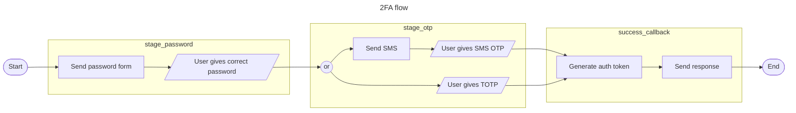

# CharonLogin

Modular authentication procedures.

## Table of Contents

- [CharonLogin](#CharonLogin)
  - [Table of Contents](#table-of-contents)
  - [Installation](#installation)
  - [Documentation](#documentation)
  - [How to Use](#how-to-use)
    - [Moving Parts](#moving-parts)
    - [Configuration](#configuration)
    - [Client Requests](#client-requests)
    
- docs
  - flow & challenges
  - configuration
  - client requests
  - example
    - flowchart
    - config
    - walkthrough

how to integrate example?
  - all explanations, then example usage
  - explanation -> example for each subject
  - example explanation + flowchart -> implementations

## Installation

If [available in Hex](https://hex.pm/docs/publish), the package can be installed
by adding `charon_login` to your list of dependencies in `mix.exs`:

```elixir
def deps do
  [
    {:charon_login, "~> 0.1.0"}
  ]
end
```

## Documentation

TODO: publish to hexdoc

## How to Use

### Moving Parts

A **flow** is used to represent the steps an account needs to take to be authenticated for a certain
action. A flow could check for email + password validation or a full multi-factor authentication
procedure.

A flow consists of one or multiple **stages**. To complete a flow all stages in it need to be
completed. The stages in a flow are ordered and need to be fulfilled one at a time.

A **challenge** represent a single authentication method. E.g. password validation or an OAuth
token. Stages contain one or multiple challenges. Only one challenge needs to be fulfilled to
complete a stage.

### Configuration

CharonLogin is configured as an optional module within [Charon](https://github.com/weareyipyip/charon).
Within the `CharonLogin` config you define you flows, stages and challenges. In addition, the config
takes callback functions to retreive user data and to handle a succesfull authentication.

```elixir
config :my_project, :charon,
  ...
  optional_modules: %{
    CharonLogin => %{
      challenges: %{
        password: {CharonLogin.Challenges.Password, %{validate: &MyProject.check_password/2}},
        sms: {CharonLogin.Challenges.OTP, %{send_otp: &MyProject.send_sms/2}},
        totp: {CharonLogin.Challenges.TOTP, %{}},
      },
      stages: %{
        stage_password: [:password],
        stage_otp: [:sms, :totp]
      },
      flows: %{
        login_2fa: [:stage_password, :stage_otp]
      },
      success_callback: &MyProject.authenticate_user/3,
      fetch_user: &MyProject.fetch_user/1
  }
}
```

This example configuration defines a flow for two-factor authentication.

The user first needs to log into their account using an email and password. This is implemented
within `CharonLogin.Challenges.Password`.

After that the user needs to fill in a one-time password. They can choose to get it sent via
SMS or they can use a a [TOTP](https://en.wikipedia.org/wiki/Time-based_one-time_password).
The TOTP and SMS implementations are seperate challenges, wrapped up in `:stage_otp`.



### Client Requests

CharonLogin expects POST requests with a JSON body. When starting a flow, the body must contain a
`user_identifier`, which will be passed to the callback configured as `fetch_user/1`. This request
returns a `token` that must be passed into subsequent requests.

The following requests illustrate how a client could walk through the 2FA flow defined in
[Configuration](#configuration).

`/flows/login_2fa/start`

_Start the 2fa flow for the given user._

Request body
```json
{
  "user_identifier": "user_name_123"
}
```

Response body
```json
{
  "stages": [
    {"challenges": [
      {"key": "password", "type": "password"}
    ]},
    {"challenges": [
      {"key": "sms", "type": "otp"},
      {"key": "totp", "type": "totp"}
    ]}
  ],
  "enabled_challenges": [],
  "token": "abc123"
}
```

`/stages/stage_password/challenges/password/execute`

_Validate the user's password._

Request body
```json
{
  "token": "abc123",
  "password": "super_secure"
}
```

Response body
```json
{
  "result": "completed"
}
```

`/stages/stage_otp/challenges/sms/execute`

_Generate a one-time password. Pass it to the configured `send_otp` to send it to the user._

Request body
```json
{
  "token": "abc123"
}
```

Response body
```json
{
  "result": "continue"
}
```

`/stages/stage_otp/challenges/sms/execute`

_Validate the user's otp input._

Request body
```json
{
  "token": "abc123",
  "otp": "12345"
}
```

Response body
```json
{
  "result": "completed"
}
```

`/complete`

_Validate that all stages have been cleared. Authenticate user._

Request body
```json
{
  "token": "abc123"
}
```

The response body is generated by the function configured as `succes_callback/2`.

